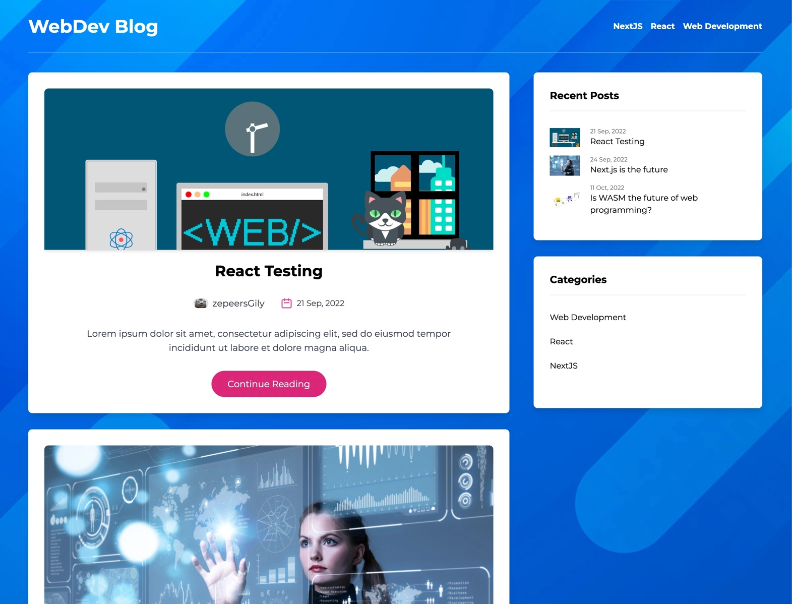

# Headless CMS Blog

A simple blog filled with random placeholder content. It has a few basic blog-typical features such as recent/related post and categories widgets, the reader has the option to leave comments etc. The frontend is built with next.js and tailwindcss on top of a headless CMS (hygraph). Data fetching is implemented with graphql. Everything is statically prerendered making browsing the site really fast!

As with all projects similar to this, its main goal is to serve as a proof of concept: proving the soundness and minimal viable functionality of the prototype. In that regard, the blog works just fine but it's by no means complete let alone full-featured. For example, although the layout is fully responsive it's missing a mobile navigation menu.

Check it out [Web Dev Blog](https://webdevblog.netlify.app/)